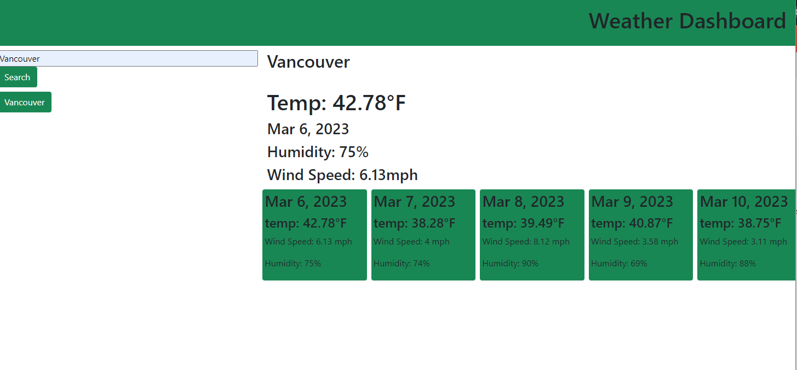

# Weather-Dashboard

## Description 
This weather Dashboard was is an easy to use application that allows for uses to input their city (or any city that they would like) and they will be given the days weather as well as a 5 day forcast. This application uses third party apis in order to aquire the data and then the application uses that data to display the most useful information, such as the date, the temp, a weather icon (that I havent been able to get to work yet), the humidity, and the wind speed. The input city will aslo be saved under the search bar so that users can quickly and easily get back to past searches. 
## Resources Used
[This is the geocoding api that gets the lat and lon from the useres input](https://openweathermap.org/api/geocoding-api#direct)

[This is the 5 day forcast api](https://openweathermap.org/forecast5)

[I used bootstrap to help with the styling of the application](https://getbootstrap.com/)

[I used ndm web docs to help with fetching the data from the apis](https://developer.mozilla.org/en-US/docs/Web/API/fetch)

[I used Day.js to get the displayed dates](https://day.js.org/en/)

## Screenshots

## Link to Deployed Site
[Deployed Site](https://elissamaine.github.io/Weather-Dashboard/)
